# 🥚 Инкубатор на Arduino Mega

Автономный контроллер инкубатора для домашней птицы на ATmega2560: поддержание
температуры и влажности, поворот лотка, проветривание, аварийная сигнализация
и меню на русском языке на дисплее 16×2.

Прошивка ведёт птицу по готовой программе инкубации от закладки до вывода —
шесть встроенных схем (куры, индейка, утки, индоутки, гуси, перепела),
каждая из четырёх периодов со своими уставками. Все параметры правятся
с кнопок и переживают отключение питания.

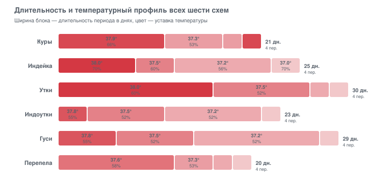

| | |
|---|---|
| **Платформа** | Arduino Mega 2560 (ATmega2560) |
| **Дисплей** | HD44780 16×2, русская кодировка |
| **Датчики** | HTU21D (воздух), до 4× DS18B20 (яйцо/зоны), DS1307 (часы) |
| **Занято** | FLASH 15 %, SRAM 21 % |
| **Лицензия** | MIT |

---

## Содержание

- [Возможности](#возможности)
- [Железо и подключение](#железо-и-подключение)
- [Сборка и прошивка](#сборка-и-прошивка)
- [Первый запуск](#первый-запуск)
- [Управление и карта меню](#управление-и-карта-меню)
- [Режимы инкубации](#режимы-инкубации)
- [Как работает регулирование](#как-работает-регулирование)
- [Аварийная сигнализация](#аварийная-сигнализация)
- [Архитектура прошивки](#архитектура-прошивки)
- [Карта EEPROM](#карта-eeprom)
- [Журнал в Serial](#журнал-в-serial)
- [Что было исправлено](#что-было-исправлено)
- [Лицензия](#лицензия)

---

## Возможности

- **Программа инкубации по периодам.** Шесть схем × четыре периода. Для каждого
  периода задаются длительность, уставка температуры, уставка влажности,
  число поворотов лотка в сутки, число и длительность проветриваний.
- **Два контура регулирования.** Нагрев ТЭНом и охлаждение обдувом; увлажнение
  испарителем и осушение вытяжкой. Закон квадратичный, с зоной
  нечувствительности и настраиваемым минимальным процентом включения.
- **Защита кладки от перегрева.** Отдельный датчик на яйце: если яйцо теплее
  уставки больше чем на заданную дельту — нагрев блокируется, а обдув
  включается на полную, пока перегрев не уйдёт (гистерезис).
- **Поворот лотка** по расписанию, с концевиками крайних положений и
  автоматическим центрированием перед открытием двери.
- **Плановое проветривание** с остановкой увлажнения на время продува.
- **Контроль двери.** При открытой двери нагрев и увлажнение выключаются,
  через три минуты поднимается авария.
- **Аварийная сигнализация** — светодиод и звук, с квитированием кнопкой.
- **Сторожевой таймер** (WDT) перезапускает контроллер при зависании.
- **Все настройки в EEPROM**, полный сброс к заводским — удержанием кнопки.
- **Журнал в Serial** на 9600 бод — можно писать историю инкубации.

---

## Железо и подключение

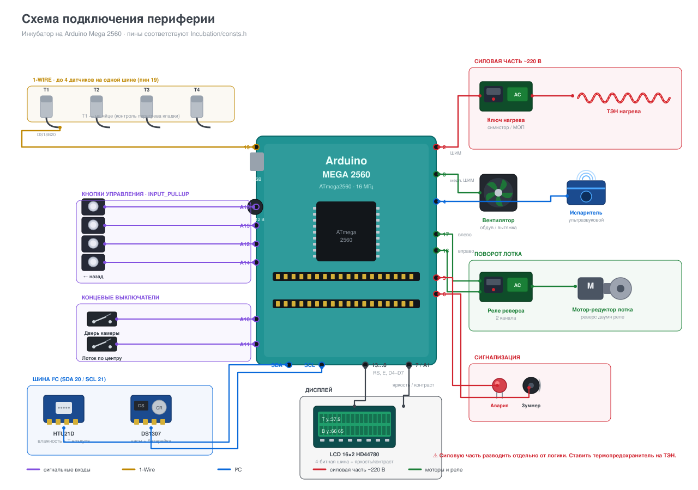

<details>
<summary>Та же распиновка списком</summary>

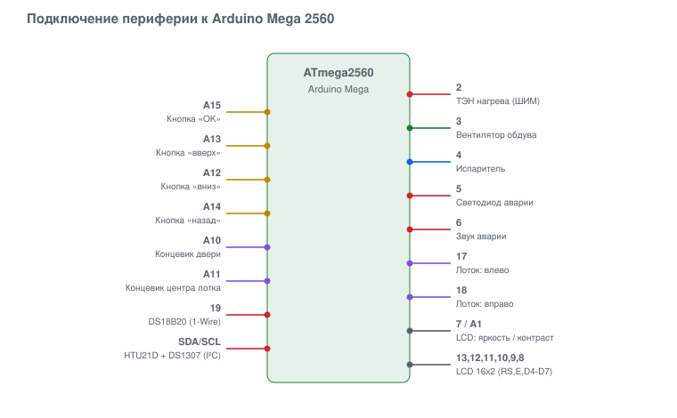
</details>

### Список компонентов

| Узел | Компонент | Примечание |
|---|---|---|
| Контроллер | Arduino Mega 2560 | нужен объём SRAM и число пинов |
| Дисплей | LCD 16×2 HD44780 | подключён по 4-битной шине |
| Влажность и температура воздуха | HTU21D | шина I²C |
| Температура яйца и зон | DS18B20 ×1…4 | одна шина 1-Wire на пине 19 |
| Часы реального времени | DS1307 | шина I²C, с батарейкой |
| Нагрев | ТЭН через симисторный/МОП-ключ | ШИМ на пине 2 |
| Обдув и вытяжка | вентилятор через ключ | пин 3, «медленный» ШИМ |
| Увлажнение | ультразвуковой испаритель | пин 4 |
| Лоток | мотор-редуктор + реле реверса | пины 17 и 18 |
| Концевики | лоток по центру, дверь | пины A11 и A10, `INPUT_PULLUP` |
| Сигнализация | светодиод и зуммер | пины 5 и 6 |
| Регулировка дисплея | яркость и контраст | пины 7 и A1 |
| Кнопки | 4 тактовые кнопки на землю | A15, A13, A12, A14 |

> ⚠️ **Безопасность.** Инкубатор — это нагреватель без присмотра.
> Ставьте независимый термопредохранитель на ТЭН, разводите силовую часть
> и логику раздельно, питайте контроллер от отдельного источника.
> Прошивка распространяется без гарантий (см. лицензию).

---

## Сборка и прошивка

### Библиотеки

| Библиотека | Назначение |
|---|---|
| `Bounce2` | антидребезг кнопок и концевиков |
| `Time` | системное время |
| `DS1307RTC` | часы реального времени |
| `OneWire` + `DallasTemperature` | датчики DS18B20 |
| `SparkFun HTU21D Humidity and Temperature Sensor Breakout` | датчик HTU21D |
| `GyverWDT` | сторожевой таймер ATmega2560 |

`LiquidCrystalRus` (русификация HD44780) входит в состав репозитория.

### Через arduino-cli

```bash
arduino-cli core install arduino:avr
```

```bash
arduino-cli lib install "Bounce2" "Time" "DS1307RTC" "OneWire" "DallasTemperature" "GyverWDT" "SparkFun HTU21D Humidity and Temperature Sensor Breakout"
```

```bash
arduino-cli compile -b arduino:avr:mega Incubation
```

```bash
arduino-cli upload -b arduino:avr:mega -p COM3 Incubation
```

### Через Arduino IDE

Откройте `Incubation/Incubation.ino`, выберите плату **Arduino Mega or Mega 2560**,
процессор **ATmega2560 (Mega 2560)**, установите библиотеки из таблицы выше.

### Через Visual Studio

В корне лежит решение `Incubation.sln` для расширения
[Visual Micro](https://www.visualmicro.com/).

---

## Первый запуск

1. Подайте питание. На дисплее появится «Выберите режим / и период старта» —
   это значит, что цикл ещё не запущен.
2. Кнопкой **«назад»** перейдите в меню → **Основное меню** → **Запуск цикла**.
3. Выберите вид птицы, период и день старта, затем **удерживайте «OK»** —
   цикл запустится, часы установятся на выбранный день.

### Сброс к заводским настройкам

Удерживайте кнопку **«назад»** при подаче питания. Светодиод мигает, пока
кнопка удерживается; через 5 секунд он загорается ровно — можно отпускать.
EEPROM будет очищена, а таблицы режимов перезаписаны заводскими значениями
(тройная вспышка светодиода — готово).

---

## Управление и карта меню

Четыре кнопки:

| Кнопка | Пин | Короткое нажатие | Длинное нажатие |
|---|---|---|---|
| **OK** (влево) | A15 | войти в пункт / следующее поле | подтверждение (запуск цикла); квитирование звука |
| **Вверх** | A13 | следующий пункт | увеличение значения с автоповтором |
| **Вниз** (вправо) | A12 | предыдущий пункт | уменьшение значения с автоповтором |
| **Назад** | A14 | на уровень выше / переключить меню↔статус | **сразу в корень** |

Экраны статуса листаются по кругу как кнопкой «OK», так и «вверх»/«вниз».
Через минуту бездействия подсветка гаснет, а прибор возвращается к статусу.

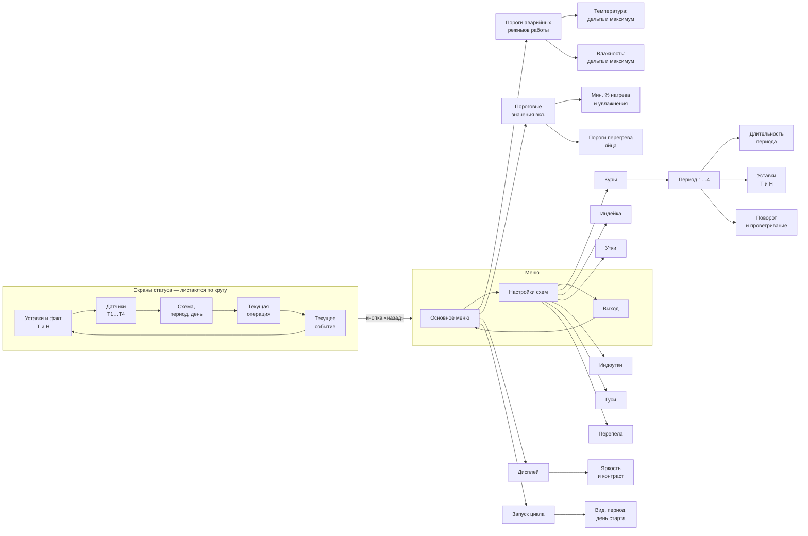

### Редактирование значения

Войдите в экран, нажимайте **OK** — фокус переходит по полям, активное поле
мигает. Кнопками «вверх»/«вниз» меняйте значение (удержание — автоповтор).
Ещё одно нажатие **OK** переводит к следующему полю и сохраняет всё в EEPROM.
Пока поле редактируется, уйти с экрана нельзя — значение не потеряется.

---

## Режимы инкубации

Уставки хранятся компактно: температура как `(°C − 30) × 10`, влажность
как `% − 45`. Это позволяет держать всю строку режима в шести байтах.

<details open>
<summary><b>Куры — 21 день</b></summary>

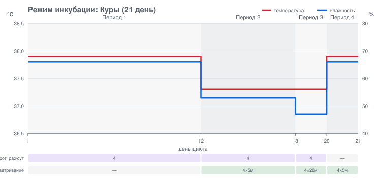
</details>

<details>
<summary><b>Индейка — 25 дней</b></summary>

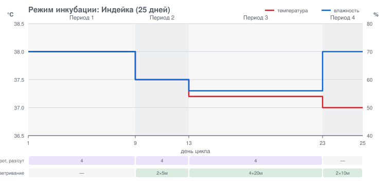
</details>

<details>
<summary><b>Утки — 30 дней</b></summary>

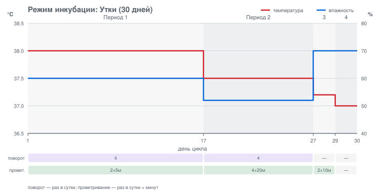
</details>

<details>
<summary><b>Индоутки — 23 дня</b></summary>

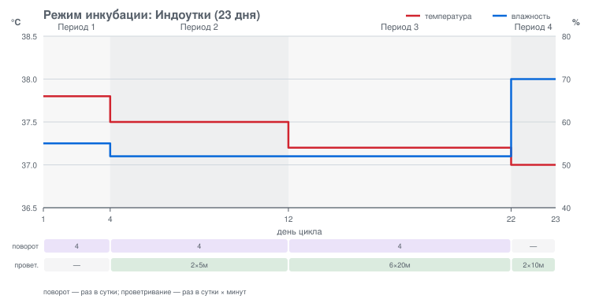
</details>

<details>
<summary><b>Гуси — 29 дней</b></summary>

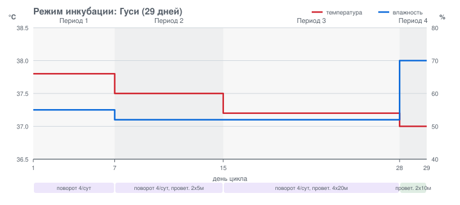
</details>

<details>
<summary><b>Перепела — 20 дней</b></summary>

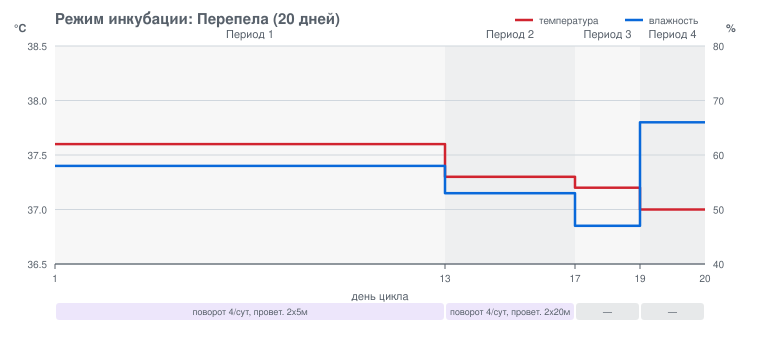
</details>

Любую схему можно отредактировать прямо на приборе: **Меню → Настройки схем →**
вид птицы **→** период.

---

## Как работает регулирование

### Закон мощности

Мощность растёт как квадрат отклонения от уставки и достигает 100 % на
аварийном пороге `alTmpMax` (для влажности — `alHumMax`). Ниже порога
`alTmpDel` мощность не меняется — это зона нечувствительности, она не даёт
исполнительным устройствам «дёргаться» вокруг уставки.

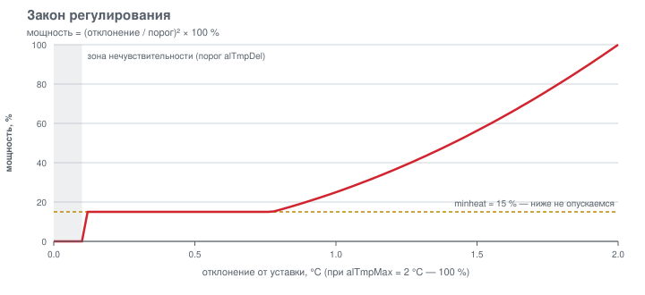

### «Медленный» ШИМ

Вентилятор и испаритель не терпят обычного `analogWrite`: на малых значениях
они гудят и не дают тяги. Вместо этого используется программный ШИМ с
периодом включения 5 секунд и переменной паузой.

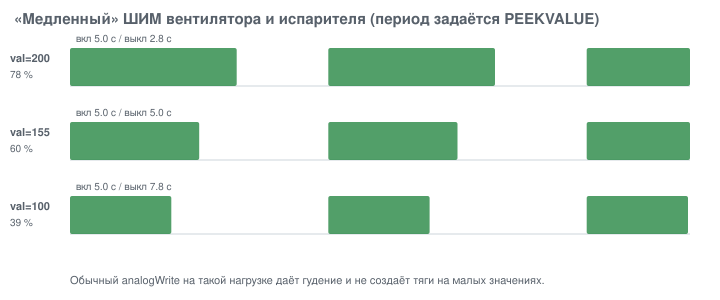

### Один вентилятор — три потребителя

Обдув просят сразу три подсистемы: охлаждение, осушение и плановое
проветривание. Побеждает самый требовательный запрос — так они не спорят
за один мотор.

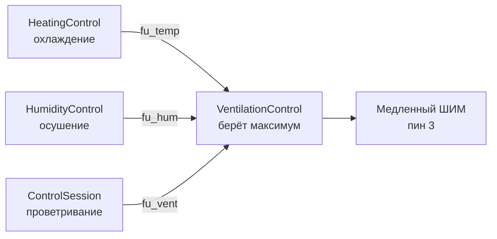

### Шаг основного цикла

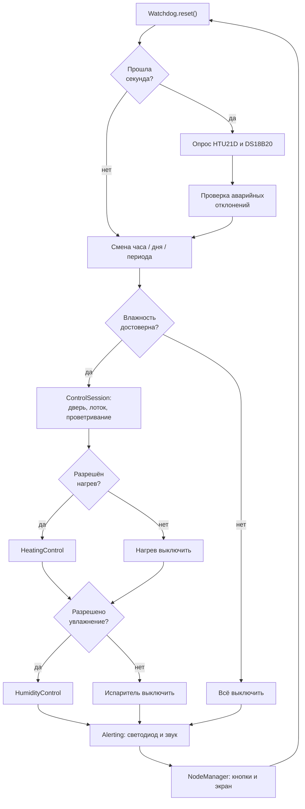

---

## Аварийная сигнализация

| Событие | Условие |
|---|---|
| Дверь открыта!!! | дверь открыта дольше 3 минут |
| Текущий план выполнен! | закончился последний период (или цикл не запущен) |
| Расхождение по температуре!! | любой датчик отклонился от уставки больше `alTmpMax` |
| Расхождение по влажности!! | отклонение больше `alHumMax` |
| Ошибка основного датчика!! | HTU21D не отвечает |

Светодиод мигает при любой активной аварии. Звук можно заглушить кнопкой
«OK»; после осознанных действий оператора (открытие двери) звук
автоматически молчит три минуты, чтобы не мешать работе.

---

## Архитектура прошивки

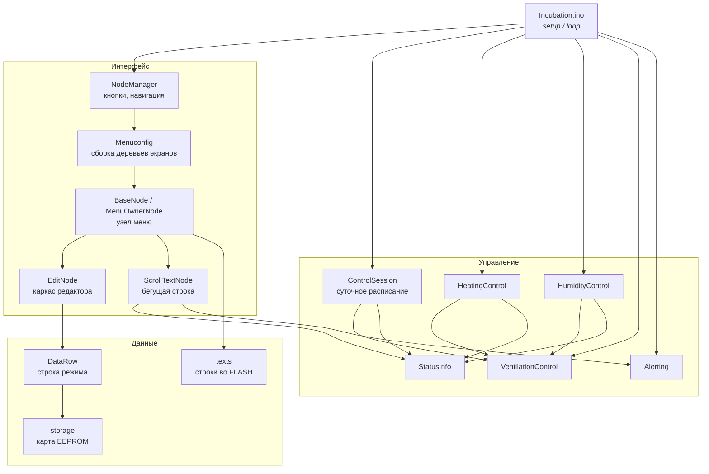

### Дерево экранов

Экран — это узел, связанный в четыре стороны: `Prev`/`Next` — соседи одного
уровня (кольцевой список), `Inner` — вложенный экран, `Owner` — родительский.
Узел-владелец (`MenuOwnerNodeClass`) создаёт своё подменю **по требованию**,
при входе в него, и освобождает при выходе. В памяти одновременно живёт
только одна ветка дерева, а не всё меню целиком.

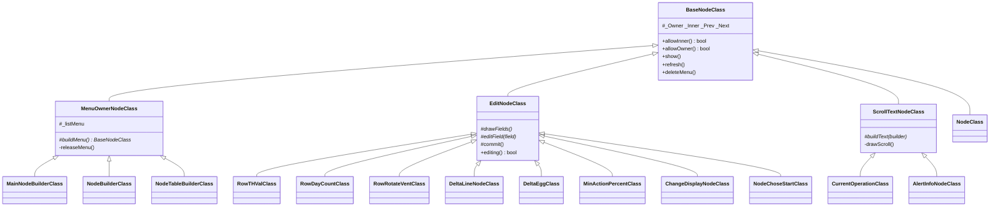

### Состав файлов

| Файл | Назначение |
|---|---|
| `Incubation.ino` | `setup()`, `loop()`, опрос датчиков, ход времени |
| `consts.h` | распиновка и интервалы |
| `objects.h/.cpp` | глобальные объекты и состояние прибора |
| `texts.h/.cpp` | все строки интерфейса во FLASH + `TextBuilder` |
| `storage.h/.cpp` | карта EEPROM и заводские таблицы режимов |
| `timing.h` | корректная работа с `millis()` |
| `DataRow.h/.cpp` | строка режима инкубации |
| `BaseNode.h/.cpp` | узел меню и владелец подменю |
| `EditNode.h/.cpp` | каркас экрана редактирования |
| `ScrollTextNode.h/.cpp` | экран с бегущей строкой |
| `NodeManager.h/.cpp` | опрос кнопок и навигация |
| `menuconfig.h/.cpp` | сборка деревьев экранов |
| `ControlSession.h/.cpp` | суточное расписание, дверь, лоток |
| `HeatingControl`, `HumidityControl`, `VentilationControl` | контуры регулирования |
| `Alerting.h/.cpp` | аварийная сигнализация |
| `StatusInfo.h/.cpp` | текущая занятость устройств |
| `LiquidCrystalRus.h/.cpp` | русифицированный драйвер HD44780 |
| `LCDAdjustments.h/.cpp` | яркость и контраст дисплея |

---

## Карта EEPROM

| Адрес | Поле | Значение |
|---|---|---|
| 0 | `bright` | яркость подсветки, % |
| 1 | `contr` | контраст, % |
| 2 | `magic` | признак «настройки проинициализированы» |
| 3 | `alTmpDel` | порог включения нагрева, 0.1 °C |
| 4 | `alTmpMax` | аварийное отклонение по температуре, °C |
| 5 | `alHumDel` | порог включения увлажнения, % |
| 6 | `alHumMax` | аварийное отклонение по влажности, % |
| 13 | `currentDay` | текущий день периода |
| 14 | `currentPeriod` | текущий период (0…3) |
| 15 | `currentTable` | текущая схема (0…5) |
| 16 | `started` | цикл запущен |
| 17 | `currentHour` | текущий час |
| 18 | `minheat` | минимальный процент нагрева |
| 19 | `minhum` | минимальный процент увлажнения |
| 20 | `deltaEggMin` | перегрев яйца: нижний порог, 0.1 °C |
| 21 | `deltaEggMax` | перегрев яйца: верхний порог, 0.1 °C |
| 22 | `timerUpdated` | часы синхронизированы |
| 255 + … | таблицы режимов | 6 схем × 4 периода × 9 байт |

Адрес строки режима: `255 + период × 9 + схема × 36`.
Поля внутри строки: длительность, температура, влажность, поворот,
число проветриваний, длительность проветривания.

---

## Журнал в Serial

Скорость **9600 бод**. Прибор пишет состояние при каждой перерисовке экрана
статуса — примерно раз в три секунды:

```
Текущая схема: Куры, период: 1, день: 5, время: 14:32:07
Температура: Установленная: 37.9, текущая: 37.8
Влажность: Установленная: 66, текущая: 65.4
Температура: Датчик N1: 37.8; Датчик N2: 37.9; Датчик N3: ----; Датчик N4: ----
Текущая операция: Нагрев (42%); Испаритель (18%)
Текущее событие: Отклонений нет
```

---

## Что было исправлено

Прошивка прошла полный рефакторинг: исправлены ошибки работы с памятью,
устранены утечки и переполнения буферов, убрано дублирование.

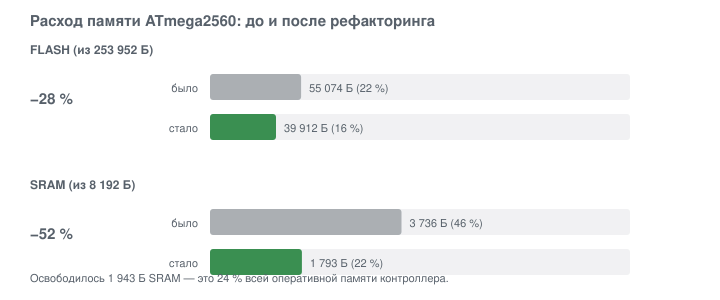

### Критические ошибки

| Где | Что было |
|---|---|
| `CurrentOperation`, `AlertInfoNode` | `memcpy` 32 байт из строки произвольной длины в буфер без завершающего нуля — чтение за границей и печать мусора на дисплей |
| `NodeBuilder`, `NodeTableBuilder`, `MainNodeBuilder`, `Menuconfig` | поле `_listMenu` не инициализировалось, но проверялось на `!= nullptr` — переход по случайному указателю из SRAM |
| `ControlSession::refresh` | `millis() + _refreshtimmer > REFRESHDATA` — плюс вместо минуса, условие всегда истинно |
| `function.cpp::scrollBar` | функция не возвращала значение на всех путях — вызывающий код получал мусор вместо `false` |
| `TemperatureStatusInfo` | `delete lDev` вместо `delete[] lDev`, размер массива перечитывался из `getDeviceCount()` и мог не совпасть с выделенным |
| `Incubation.ino`, `NodeChoseStart` | `timerUpdated` писался по адресу 17, занятому под `currentHour` — значения затирали друг друга |
| `HumidityControl::refresh` | при максимальном запросе на увлажнение испаритель **выключался** вместо включения |
| `MainNodeBuilder` | часть узлов не получала `Owner` — кнопка «назад» на них не работала |
| `HeatingControl`, `HumidityControl` | деление на `sq(alTmpMax)` без проверки нуля — `NaN` на выходе регулятора |
| `DataRow` | поля класса, включая кэш `_from`, не инициализировались |
| `Incubation.ino` | `Watchdog.reset()` вызывался только раз в секунду внутри условия; `delay(3000)` при запуске цикла мог привести к перезагрузке |

### Память

| Что | Как было | Как стало |
|---|---|---|
| Строки интерфейса | `String gettextprj(byte)` — объект `String` в куче на каждый вызов, на каждой отрисовке | таблица в PROGMEM, печать напрямую из FLASH, 0 байт RAM |
| Сборка строк статуса и аварий | конкатенация `String` с `realloc` на каждом шаге | `TextBuilder` в фиксированный буфер, переполнение невозможно |
| Объекты `Bounce` | четыре `const Bounce` в заголовке → по копии в **каждом** `.cpp` проекта | один массив на весь проект |
| Строка режима `DataRow` | `new` + `delete` на каждой отрисовке экрана | объект на стеке |
| Адреса датчиков DS18B20 | двухуровневое выделение в куче | статический массив на 4 элемента |
| Подменю при удалении узла | не освобождалось — утечка | освобождается деструктором рекурсивно |
| Заводские таблицы | ~130 строк копипасты в `setup()` | таблица в PROGMEM (144 байта) и один цикл |

### Архитектура

- Введён `MenuOwnerNodeClass` — создание и освобождение подменю описано
  один раз вместо четырёх копий.
- Введён `EditNodeClass` — каркас экрана редактирования вместо восьми
  почти дословных копий логики переключения полей и мигания.
- Введён `ScrollTextNodeClass` — бегущая строка вместо двух копий кода
  с одинаковым переполнением буфера.
- Все адреса EEPROM собраны в `storage.h` — раньше магические числа были
  разбросаны по десятку файлов, что и породило конфликт адреса 17.
- `abs(millis() - t) > X` заменено на `expired(t, X)`: макрос `abs()`
  вычислял `millis()` дважды и был бессмысленным для беззнаковой арифметики.
- Удалён мёртвый код: `initialize`, `CurrentTimeStatusNode` (содержал
  блокирующий `delay(500)` в цикле отрисовки), `variables`, `functions.h`.
- Навигация: длинное нажатие «назад» возвращает сразу в корень; экраны
  статуса листаются в обе стороны, а не только одной кнопкой.

### Поведение

- Уставки заводских таблиц заданы точно. Раньше пересчёт шёл через `float`,
  и `(37.3 − 30) × 10` давало `72.99999` с усечением до `72` — часть уставок
  «съезжала» на 0.1 °C вниз.
- Значения при выходе за границы диапазона больше не оставляют «хвост»
  от предыдущего, более длинного числа на дисплее.
- Нижний порог перегрева яйца не может стать выше верхнего.
- При включении прибора влажность считается недостоверной, пока датчик
  не опрошен, — испаритель не включается «вслепую» на первую секунду.

---

## Лицензия

[MIT](LICENSE) © Alexey Kozlov

Код `LiquidCrystalRus` — Ilya V. Danilov, на основе `LiquidCrystal` из Arduino IDE.
Код `LCDAdjustments` — Andy Brown, лицензия CC BY-SA 3.0.

---

## Иллюстрации

Все схемы и графики в `docs/img/` генерируются скриптами и строятся
из тех же данных, что зашиты в прошивку, — они не могут разойтись с кодом.

```bash
cd docs && python gen_docs.py && python gen_wiring.py && python check_overlap.py
```

`check_overlap.py` проверяет, что подписи на схемах нигде не накладываются
друг на друга.

---

## Версионирование и релизы

Версия вычисляется автоматически из сообщений коммитов
([conventional commits](https://www.conventionalcommits.org/ru/)).
После каждого push в `master` workflow `Релиз` сам определяет уровень,
собирает прошивку и публикует релиз с приложенным `.hex`.

| Префикс коммита | Уровень | Пример |
|---|---|---|
| `BREAKING CHANGE` или `тип!:` | мажорная | `2.1.0` → `3.0.0` |
| `feat:` | минорная | `2.0.1` → `2.1.0` |
| `fix:`, `perf:`, `refactor:` | патч | `2.0.0` → `2.0.1` |
| `docs:`, `chore:`, `ci:`, `test:`, `style:` | релиз не создаётся | |

Уровень можно задать вручную: **Actions → Релиз → Run workflow**.

Workflow `Сборка` на каждый push и pull request собирает прошивку с
`--warnings all`, проверяет отсутствие предупреждений в файлах проекта,
перегенерирует иллюстрации и сверяет их с содержимым `docs/img`.
